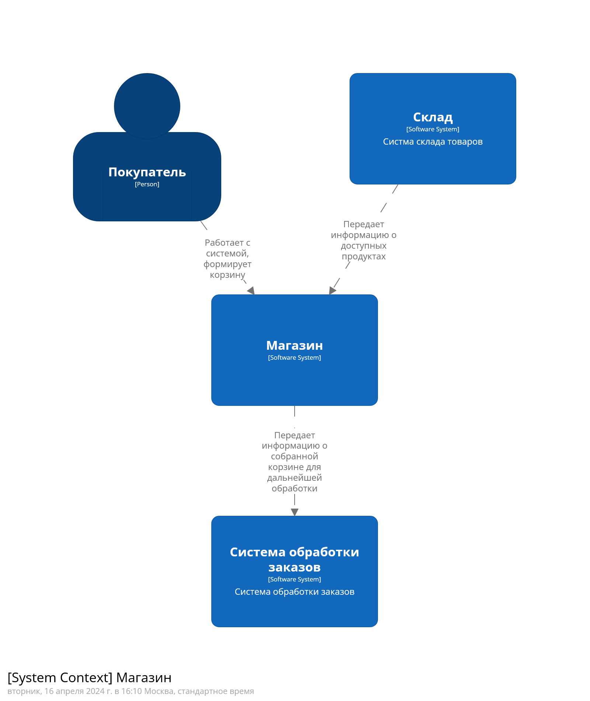
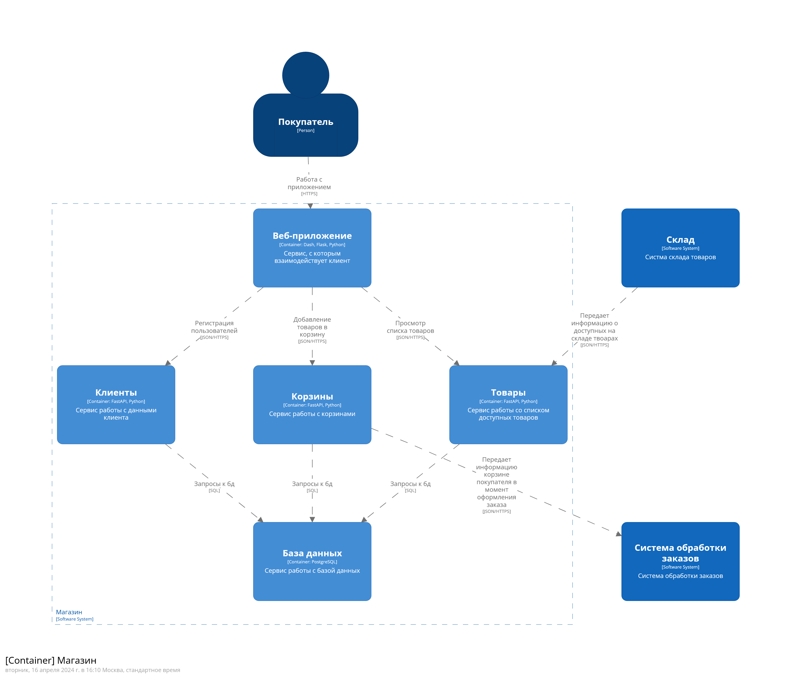

# Лабораторные работы по архитектуре ПО

Вполнил: Гаврилов М.С.  
группа: М8О-107М-23  
вариант: 2 (Магазин)  

## Лабораторная работа 1

### Задание

    Должны быть спроектированы сервисы, согласно вашему варианту задания
    Должны быть указаны вызовы между сервисами
    Должны быть описаны API (методы, входы, выходы)
    Должна быть описана логическая модель данных

### Результаты

    Исходный код лежит в ./main_diags.dsl
    Динамические диаграммы лежат по адресу ./diags_imgs/dynamic
    Диаграммы компонентов лежат по адресу ./diags_imgs/components
    **Описание надо сделать**  

#### Контекстная диаграмма:

#### Диаграма контейнеров:

